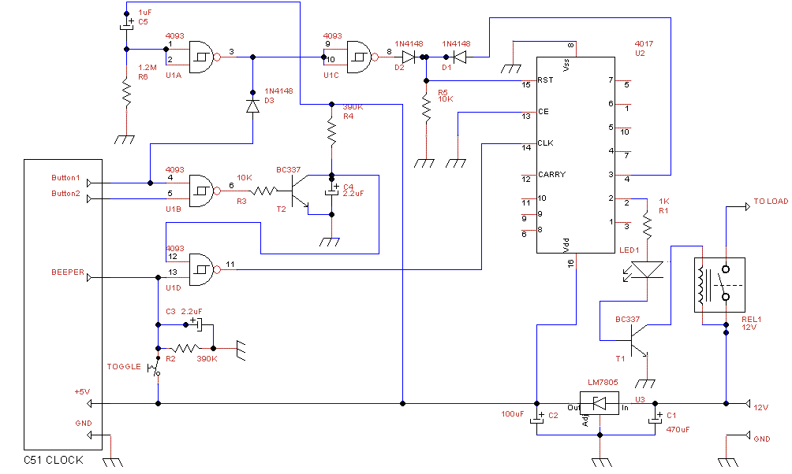
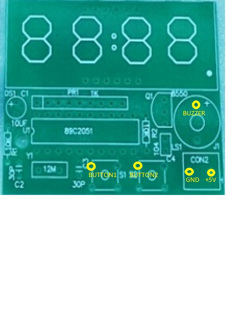
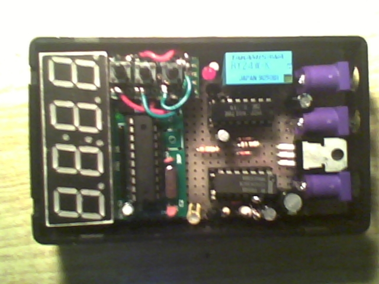

# C51CLOCK_TO_TIMER
Turn a "c51 4bit clock" in a 24h timer

You can buy this clock for 1$ shipped on aliexpress and it works as expected, but you can not change the software. 
I've bought a pair of this clocks to turn them in a timer changing a little bit the code, but the cpu used is a 89c2051 with only parallel programming interface (the 89s2051 has a serial mode much easier to use) and I had no patience to put together such a device.
The source code is not available and, to be honest, is pointless to mess with a 8051 cpu when you can get a much easier AVR and the Arduino IDE.

What is missing in this clock to turn it in a timer?
It is really easy to hook a relais instead the beeper but there are some problems.
First the default setup is horrible: it start, after a reset, at 12:59 with hourly chimes at 13:00, first alarm at 13:01 and second alarm at 13:02.
Moreover every button click generates a beep.

The target are these two: remove the buttons beep and stop the default alarms.

Messing a little bit with the buttons I've discovered that, pressing Button1 at reset, the clock enter the programming mode and does not play the alarms.

So I need:
-a circuit to force Button1 at reset to enter in programming mode
-a circuit to mute the beeper on button click
-a circuit to toggle a relais on regular alarms
-a circuit to switch on and off the relais manually

C1                            1   470uF
C2                            1   100uF
C3,C4                         2   2.2uF
C5                            1   1uF
D1,D2,D3                      3   1N4148
LED1                          1   LED
R1                            1   1K
R2,R4                         2   390K
R3,R5                         2   10K
R6                            1   1.2M
REL1                          1   12V
T1,T2                         2   BC337
U1                            1   4093
U2                            1   4017
U3                            1   LM7805

The hooking points to the original clock are:

The final assembly is:

At startup you have to program the two alarms to on/off the relais. Moreover you have to disable the hourly chimes.

